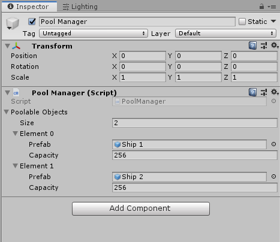

# Pool Manager

## Goal
Instantiating a GameObject in Unity is a costly operation, which can slow down frame rate if done frequently. Rather than instantiating and destroying GameObjects during gameplay, it is often better to instantiate GameObjects ahead of time, and then use and reuse them when needed. This is called "object pooling," and it is the purpose of the Pool Manager.

The Pool Manager is designed to mimic the workflow of instantiating GameObjects normally. After setup, the only change needed is to replace each line of ```Instantiate(...)``` with ```PoolManager.Instance.Instantiate(...)```.


## Setup

The project contains several assets to help demonstrate the functionality of the Pool Manager. However, the only assets needed to add the Pool Manager to a project are the PoolManager script and the Manager script.

Add the Pool Manager script to a GameObject in the scene. For every prefab you'd like the Pool Manager to handle, add an element to the Poolable Objects list in the Inspector. Drag the prefab into the "Prefab" field and specify a starting capacity in the "Capacity" field.

In the example below, the Pool Manager is going to be handling the instantiation of two prefabs: Ship 1 and Ship 2. On scene load, the Pool Manager will instantiate 256 copies of each ship, and then use and reuse them during gameplay.



At any time, if more copies of a prefab are needed, the Pool Manager will double the capacity for that prefab.


## Use

To activate a GameObject using the PoolManager, use the usual workflow for instantiation, but call ```PoolManager.Instance.Instantiate(...)``` instead of ```UnityEngine.GameObject.Instantiate(...)```.

Whenever a GameObject is activated by the PoolManager, ```OnEnable()``` will be called on its components. When it is deactivated, ```OnDisable()``` will be called on its components. Therefore, for scripts attached to each GameObject, put any initialization in ```OnEnable()``` rather than ```Start()``` or ```Awake()```. You may also choose to put cleanup or reset functionality in ```OnDisable()```.

Typically, some manual resetting will be required in either ```OnEnable()``` or ```OnDisable()```. For example, if a GameObject has a Rigidbody, its velocity will need to be zeroed out in ```OnEnable()``` or ```OnDisable()```. Otherwise, the next time that copy is activated, its previous velocity will carry over.


## Notes

1. The Manager class is much like a singleton, except it won't create an instance if one is not found. It's merely an instance-getter that allows any script to access the Pool Manager. If you wish to remove the Manager, change the Pool Manager's class declaration from

```public class PoolManager : Manager<PoolManager>```

to

```public class PoolManager : MonoBehaviour```

After that, the Manager class is no longer needed.


## Acknowledgements

Thanks to Mark Placzek for [this tutorial](https://www.raywenderlich.com/847-object-pooling-in-unity), which helped me speed up and simplify this Pool Manager by using ```OnEnable()``` and ```OnDisable()```. Previously, I'd been using a Poolable interface, which wasn't very much fun.


